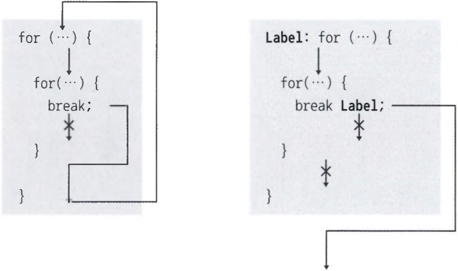

# Multicampus Java day05

## 2022-04-12

>

### 1. for

- 구구단 출력하기(이중 for문)

  ```java
  public static void main(String[] args) {
      for (int m=2; m<=9; m+) {
      	System.out.printlnC'*** " + m + "단 ***");
          for (int n=1; n<=9; n++) {
              System.out.println(m + " x " + n + " = " + (m치"!));
          }
  	}
  }
  ```

  - for문은 또 다른 for문을 내포할 수 있는데, 이를 중첩된 for문이라고 한다.
  - 바깥쪽 for문이 한 번 실행될 때마다 안쪽 for문은 지정된 횟수만큼 돌다가 다시 바깥쪽 for문으로 돌아간다.

- outter

  ```java
  public static void main(String[] args) {
      outter:
      for(char upper='A'; upper <= 'Z'; upper++) {
          for(char lower='a'; lower <= 'z'; lower++) {
              System.out.println(upper + "-" + lower);
              if(lower == 'g') {
                  break outter;
              }
          }
      }
  }
  ```

  - 만약 반복문이 중첩되어 있을 경우, break문은 가장 가까운 반복문만 종료하고 바깥쪽 반복문은 종료시키지 않는다.

  - 중첩된 반복문에서 바깥쪽 반복문까지 종료시키려면 바깥쪽 반복문에 이름(라벨)을 붙이고, `break 이름;`을 사용하면 된다.

    

### 2. while

#### 1.1 이중 while문

- 좌표 출력하기

  ```java
  public static void main(String[] args) {
      int i = 0;
      while(i < 5) {
          int j = 0;
          while(j < 5) {
              System.out.printf("%d %d\t", i,j);
              j++;
          }
          System.out.println("");
          i++;
      }
  }
  // 결과
  0 0		0 1		0 2		0 3		0 4	
  1 0		1 1		1 2		1 3		1 4	
  2 0		2 1		2 2		2 3		2 4	
  3 0		3 1		3 2		3 3		3 4	
  4 0		4 1		4 2		4 3		4 4	
  ```

<br/>

#### 1.2 키보드로 while문 제어

```java
public static void main(String[] args) throws Exception {
    boolean run = true;
    int speed = 0;
    int keyCode =  0;
    
    while(run) {
        if(keyCode != 13 && keyCode != 10) {
            System.out.println("----------------------");
            System.out.println("1.증속 | 2.감속 | 3.중지");
            System.out.println("----------------------");
            System.out.println("선택: ");
        }
        // 키보드의 키 코드를 읽음
        keyCode = System.in.read();
        
        if(keyCode == 49) {	// 1을 읽었을 경우
            speed++;
            System.out.pirntln("현재 속도 = " + speed);
        }else if(keyCode == 50) {	// 2를 읽었을 경우
            speed--;
            System.out.println("현재 속도 = " + speed);
        }else if(keyCode == 51) {	// 3을 읽었을 경우
            run = false;			// while문을 종료하기 위해 false
        }
    }
}
```

- 예제를 실행하면 키 코드를 입력받기 위해 대기한다.
- Console 뷰에 키드보에서 1, 2를 각각 입력하고 Enter키를 누르면 거기에 맞는 명령이 실행된다.
- 실행 후 다시 새로운 키 코드를 입력받기 위해 대기한다.
- 3을 입력하고 Enter를 누르면 `run`이 `false`가 되어 while문이 종료된다.

