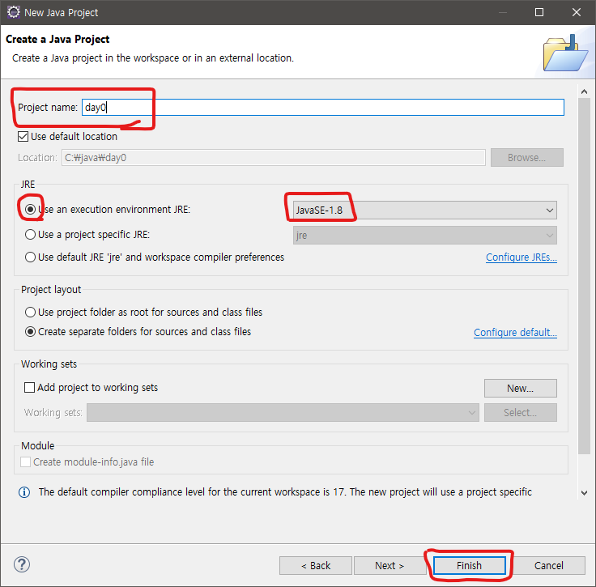
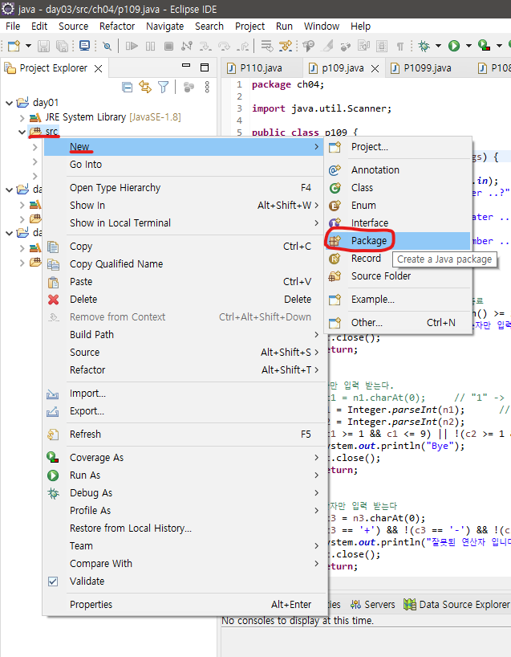
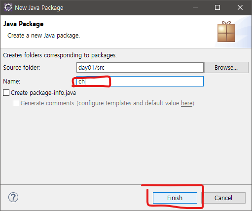
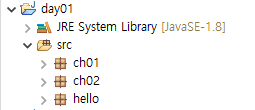
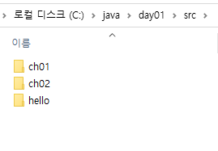
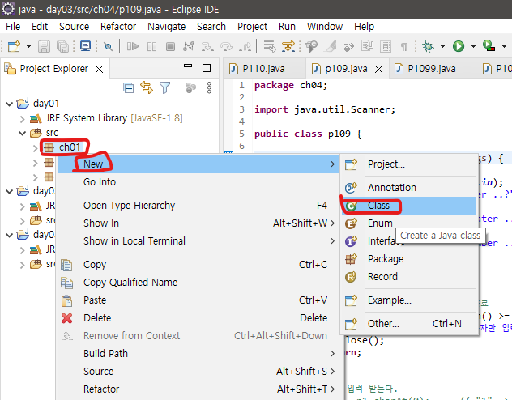
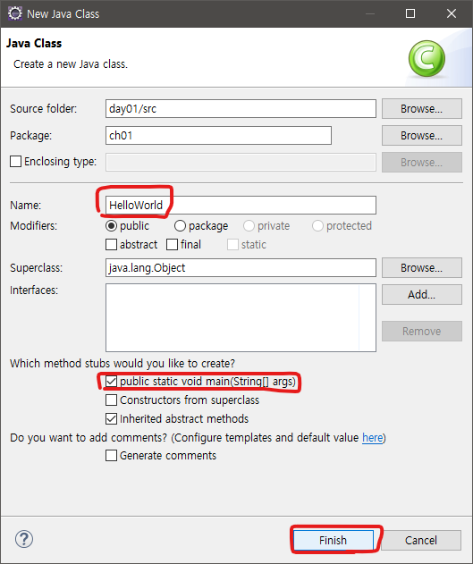
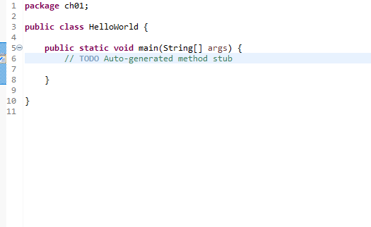
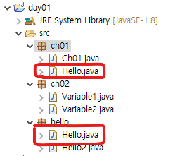

# Multicampus Day01 - 1

> 프로그래밍 언어 개요, 자바 특징
>
> 이클립스로 프로젝트, 패키지, 클래스 만드는 법

- 프로그래밍 언어 역할
  - 사람과 컴퓨터 대화에 도움
  - 자연어와 기계어 사이 다리역할
  - 고급 언어/저급 언어로 구분

- 자바란?
  - 이식성 높은 객체 지향 언어(OOPL, Object Oriented Programming Language)
  - 캡슐화, 상속, 다형성 지원
  - 함수적 스타일 코딩 지원
  - 메모리 자동 관리
  - 멀티 스레드(Multi-Thread) 쉽게 구현 가능
  - 동적 로딩(Dynamic Loading) 지원

- 이클립스(Eclipse) 사용
  - 자바 통합 개발 환경(IDE: Integrated Development Environment) Tool
  - 플러그인 설치 가능
  - 이클립스를 보완해주는 IntelliJ 존재

- 이클립스 프로젝트 만들기

  - File -> New -> Project...

  - Next

    

  - Project name에 이름을 적고 자바 버전을 확인한 후 Finish를 누른다.

  - Project Explorer에 라이브러리와 src폴더가 생성된다.

    

  - 프로젝트 하나 하나가 프로그램 하나를 의미한다

- Package 만들기

  - src폴더 위에 우클릭 -> New -> Package 클릭

  - Source folder이름을 소문자와 숫자로 적고 Finish를 누른다.

  - 

  - 그러면 src폴더 밑에 패키지가 생성이 되고 실제로 로컬저장소에는 하위폴더가 생성된다.

    

- Class 만들기

  - 패키지 우클릭 -> New -> Class 클릭

    

  - Name에 Class의 이름을 적고 "public static void main(String[] args)"에 체크 후 Finish

    

  - 그러면 이렇게 화면이 생긴다. 이제 코딩 준비 끝

    

- 같은 Package에 같은 이름의 Class는 존재할 수 없지만, 다른 Package에는 같은 이름의 Class가 존재할 수 있다.
  - 
